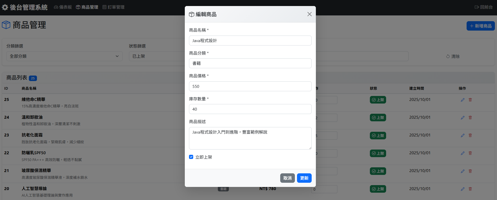

# 線上購物系統 (Online Shopping System)

基於 Spring Boot 3 + Vue.js 3 開發的簡易線上購物系統，具備完整的電商基礎功能。

## 🚀 專案簡介

本系統是一個功能完整的線上購物平台，提供商品展示、購物車、訂單管理等核心電商功能，採用前後端整合架構設計。

### 主要功能特色

#### 🛍️ 前台購物功能
- **商品瀏覽**：展示所有上架商品相關資訊
- **商品搜尋**：依商品名稱進行模糊搜尋
- **分類篩選**：多選 checkbox 即時篩選商品分類
- **購物車**：使用 localStorage 儲存，支援數量調整
- **訂單結帳**：完整的下單流程，包含收件人資訊填寫
- **訂單查詢**：客戶可依 Email 或電話查詢歷史訂單

#### ⚙️ 後台管理功能
- **商品管理**：新增、編輯、刪除商品，商品上下架控制
- **庫存管理**：即時庫存更新，庫存不足警告
- **訂單管理**：檢視所有訂單，更新訂單狀態，取消訂單
- **統計儀表板**：營業額統計、訂單數量、庫存狀況統計

## 🛠 技術架構

### 後端技術棧
- **Java**: 21 (LTS)
- **Spring Boot**: 3.5.6
- **Spring Data JPA**: 資料持久層
- **Hibernate**: ORM 框架
- **MySQL**: 關聯式資料庫
- **Maven**: 專案建置工具
- **Bean Validation**: 資料驗證

### 前端技術棧
- **Vue.js**: 3.x (Composition API)
- **Bootstrap**: 5.3.x (響應式 UI 框架)
- **Axios**: HTTP 請求庫
- **Bootstrap Icons**: 圖示庫
- **LocalStorage**: 購物車資料儲存

## 🔧 環境需求

### 必要軟體
- **Java Development Kit (JDK)**: 21 或以上版本
- **Apache Maven**: 3.6 或以上版本
- **MySQL Server**: 8.0 或以上版本
- **Git**: 版本控制工具

### 開發工具建議
- **IDE**: IntelliJ IDEA
- **資料庫管理**: DBeaver

## 📥 安裝與啟動

### 1. 取得專案原始碼
```bash
git clone https://github.com/your-username/online-shopping-system.git
cd online-shopping-system
```

### 2. 設定 MySQL 資料庫
```sql
-- 建立資料庫
CREATE DATABASE shopping_db CHARACTER SET utf8mb4 COLLATE utf8mb4_unicode_ci;
```

### 3. 設定資料庫連線
編輯 `src/main/resources/application.properties` 檔案：
```properties
spring.datasource.url=jdbc:mysql://localhost:3306/shopping_db
spring.datasource.username=root
spring.datasource.password=你的MySQL密碼
```

### 4. 下載與編譯 (確保所有套件下載，並編譯專案)
```bash
mvn clean install
```

### 5. 啟動服務 (透過 Maven 啟動 Spring Boot 應用程式)
```bash
mvn spring-boot:run
```

### 6. 存取系統
- **前台購物**: http://localhost:8080/index.html
- **後台管理**: http://localhost:8080/admin.html
- **API 文件**: http://localhost:8080/api/products

## 📡 API 說明文件

### 商品相關 API

#### 取得商品列表 (前台)
- **請求**: `GET /api/products`
- **參數**:
    - `category` (可選): 商品分類篩選
    - `search` (可選): 商品名稱搜尋
- **回應**: 上架商品列表與分類資訊

```json
{
  "success": true,
  "data": [
    {
      "id": 1,
      "name": "iPhone 15 Pro",
      "category": "電子產品",
      "price": 39900,
      "description": "最新款智慧型手機",
      "stockQuantity": 15,
      "isActive": true
    }
  ],
  "categories": ["電子產品", "服飾", "家居用品"],
  "total": 25
}
```

#### 取得商品詳情
- **請求**: `GET /api/products/{id}`
- **參數**: 商品ID
- **回應**: 商品詳細資訊

#### 取得商品分類
- **請求**: `GET /api/categories`
- **回應**: 所有商品分類列表

### 訂單相關 API

#### 建立訂單
- **請求**: `POST /api/orders`
- **內容**:
```json
{
  "customerName": "王小明",
  "customerEmail": "wang@example.com",
  "customerPhone": "0912345678",
  "customerAddress": "台北市信義區信義路五段7號",
  "notes": "請小心包裝",
  "cartItems": {
    "1": 2,
    "3": 1
  }
}
```

#### 查詢客戶訂單
- **請求**: `GET /api/orders/customer`
- **參數**:
    - `email` (可選): 客戶Email
    - `phone` (可選): 客戶電話
- **回應**: 客戶訂單列表

#### 取得訂單詳情
- **請求**: `GET /api/orders/{id}`
- **參數**: 訂單ID
- **回應**: 訂單詳細資訊與商品明細

### 後台管理 API

#### 取得所有商品 (後台)
- **請求**: `GET /api/admin/products`
- **參數**:
    - `category` (可選): 分類篩選
    - `search` (可選): 名稱搜尋
    - `isActive` (可選): 上架狀態篩選
- **回應**: 所有商品列表（包含下架商品）

#### 商品管理操作
- **新增商品**: `POST /api/admin/products`
- **更新商品**: `PUT /api/admin/products/{id}`
- **刪除商品**: `DELETE /api/admin/products/{id}`
- **切換上架狀態**: `PATCH /api/admin/products/{id}/toggle-status`
- **更新庫存**: `PATCH /api/admin/products/{id}/stock`

#### 訂單管理操作
- **取得所有訂單**: `GET /api/admin/orders`
- **更新訂單狀態**: `PATCH /api/admin/orders/{id}/status`
- **取消訂單**: `PATCH /api/admin/orders/{id}/cancel`

#### 統計資料
- **請求**: `GET /api/admin/dashboard`
- **回應**: 系統統計資料
```json
{
  "success": true,
  "data": {
    "activeProducts": 25,
    "inactiveProducts": 5,
    "todayOrdersCount": 3,
    "todaySales": 45000,
    "thisMonthSales": 150000,
    "lowStockProducts": [],
    "recentOrders": []
  }
}
```

## 🗃 資料庫結構

系統使用 3 個主要資料表：

### products (商品表)
| 欄位名 | 資料型別 | 說明 |
|--------|----------|------|
| id | BIGINT | 主鍵，自動遞增 |
| name | VARCHAR(200) | 商品名稱 |
| category | VARCHAR(100) | 商品分類 |
| price | DECIMAL(10,2) | 商品價格 |
| description | TEXT | 商品描述 |
| is_active | BOOLEAN | 是否上架 |
| stock_quantity | INTEGER | 庫存數量 |
| created_at | TIMESTAMP | 建立時間 |
| updated_at | TIMESTAMP | 更新時間 |

### orders (訂單表)
| 欄位名 | 資料型別 | 說明 |
|--------|----------|------|
| id | BIGINT | 主鍵，自動遞增 |
| customer_name | VARCHAR(100) | 收件人姓名 |
| customer_email | VARCHAR(200) | 客戶Email |
| customer_phone | VARCHAR(20) | 聯絡電話 |
| customer_address | TEXT | 收件地址 |
| total_amount | DECIMAL(10,2) | 訂單總金額 |
| status | ENUM | 訂單狀態 |
| order_date | TIMESTAMP | 下單時間 |
| notes | TEXT | 訂單備註 |

### order_items (訂單明細表)
| 欄位名 | 資料型別 | 說明 |
|--------|----------|------|
| id | BIGINT | 主鍵，自動遞增 |
| order_id | BIGINT | 訂單ID (外鍵) |
| product_id | BIGINT | 商品ID (外鍵) |
| quantity | INTEGER | 購買數量 |
| unit_price | DECIMAL(10,2) | 商品單價 |
| product_name | VARCHAR(200) | 商品名稱快照 |

# ⭐ ERD（Entity Relationship Diagram）⭐


## 🏗 專案架構說明

```
src/main/java/com/example/
├── OnlineShoppingSystemApplication.java    # Spring Boot 主程式
├── entity/                                 # JPA 實體類別
│   ├── Product.java                        # 商品實體
│   ├── Order.java                          # 訂單實體
│   └── OrderItem.java                      # 訂單項目實體
├── repository/                             # 資料存取層
│   ├── ProductRepository.java              # 商品資料存取
│   └── OrderRepository.java                # 訂單資料存取
├── service/                                # 業務邏輯層
│   ├── ProductService.java                 # 商品業務邏輯
│   └── OrderService.java                   # 訂單業務邏輯
├── controller/                             # REST API 控制器
│   └── ApiController.java                  # API 端點
└── config/                                 # 系統設定
    └── DataInitializer.java                # 測試資料初始化

src/main/resources/static/                  # 前端靜態資源
├── index.html                              # 首頁
├── cart.html                               # 購物車頁面
├── checkout.html                           # 結帳頁面
├── orders.html                             # 訂單查詢頁面
├── admin.html                              # 後台管理頁面
├── js/                                     # JavaScript 檔案
│   ├── common.js                           # 共用工具函數
│   ├── app.js                              # 首頁邏輯
│   ├── cart.js                             # 購物車邏輯
│   ├── checkout.js                         # 結帳邏輯
│   ├── orders.js                           # 訂單查詢邏輯
│   └── admin.js                            # 後台管理邏輯
└── css/
    └── style.css                           # 自訂樣式
```

## 🧪 測試建議

### 功能測試流程
1. **商品瀏覽測試**：
    - 開啟首頁檢查商品顯示
    - 測試搜尋功能
    - 測試分類多選篩選

2. **購物流程測試**：
    - 加入商品至購物車
    - 調整購物車數量
    - 完成結帳流程

3. **訂單管理測試**：
    - 查詢客戶訂單
    - 後台訂單狀態更新

4. **後台管理測試**：
    - 商品 CRUD 操作
    - 庫存管理
    - 統計資料檢視

### 預設測試資料
系統啟動時會自動建立 25 個測試商品，分為 5 個分類：
- 電子產品 (5個)
- 服飾 (5個)
- 家居用品 (5個)
- 書籍 (5個)
- 美妝保養 (5個)

## 🔄 版本紀錄

### v1.0.0 (2025-09-29)
- ✅ 完整的商品管理功能
- ✅ 購物車與訂單系統
- ✅ 響應式前端介面
- ✅ 後台管理功能
- ✅ RESTful API 設計
- ✅ 資料驗證與錯誤處理

## 😇 功能需求介面預覽
### *前台 - 購物系統首頁*:

### *前台 - 購物車*:

### *前台 - 結帳頁面*:

### *前台 - 訂單查詢*:

### *後台 - 監控儀表板*:

### *後台 - 商品管理*:


---

**感謝使用線上購物系統！** 🎉